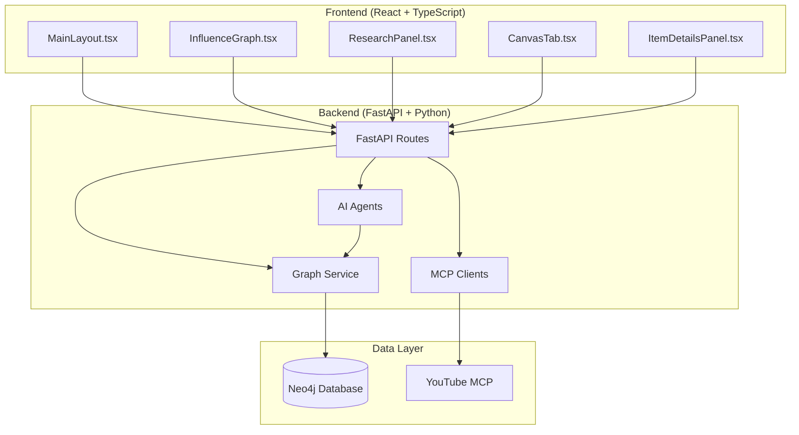
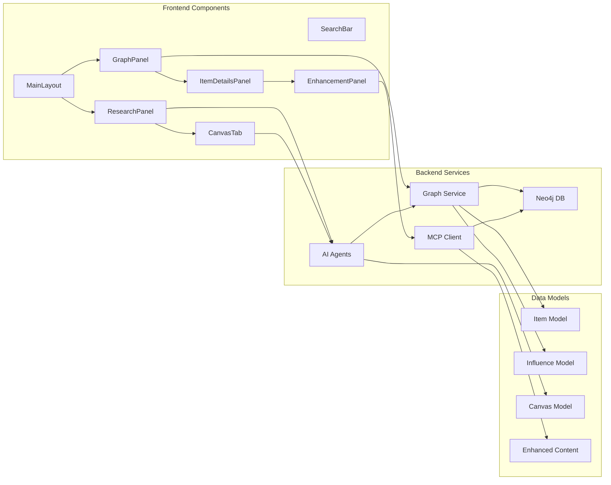
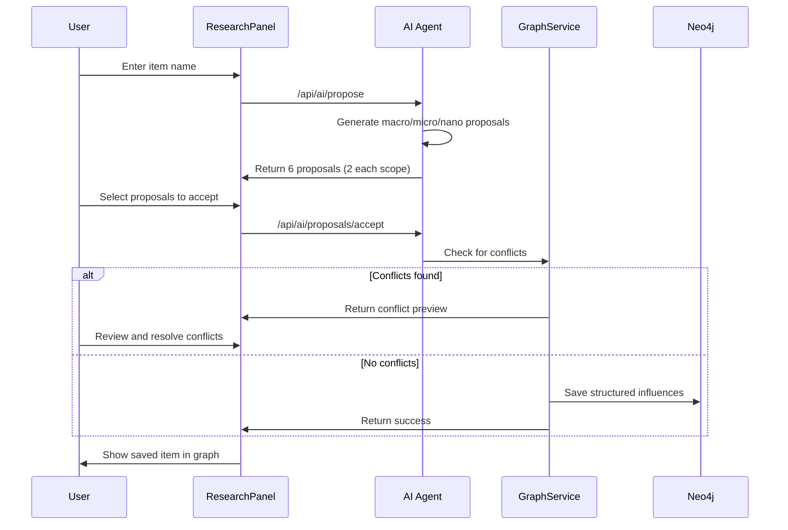
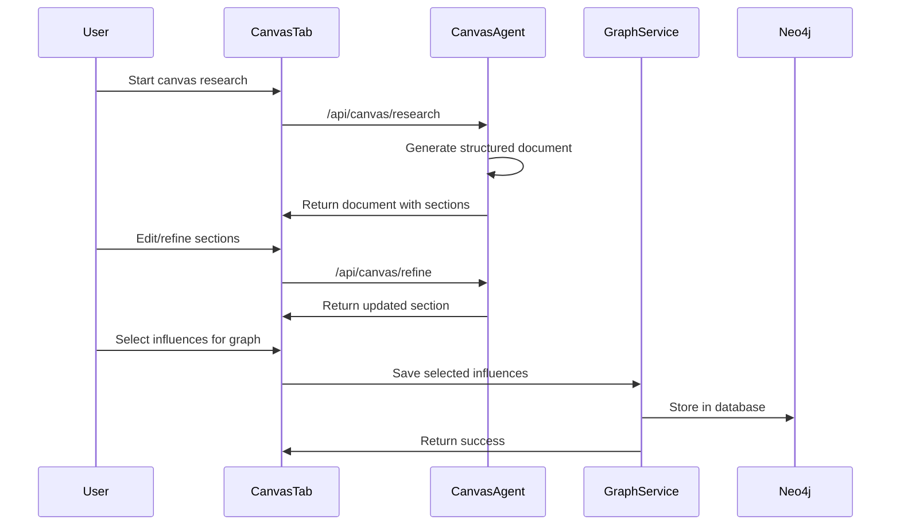
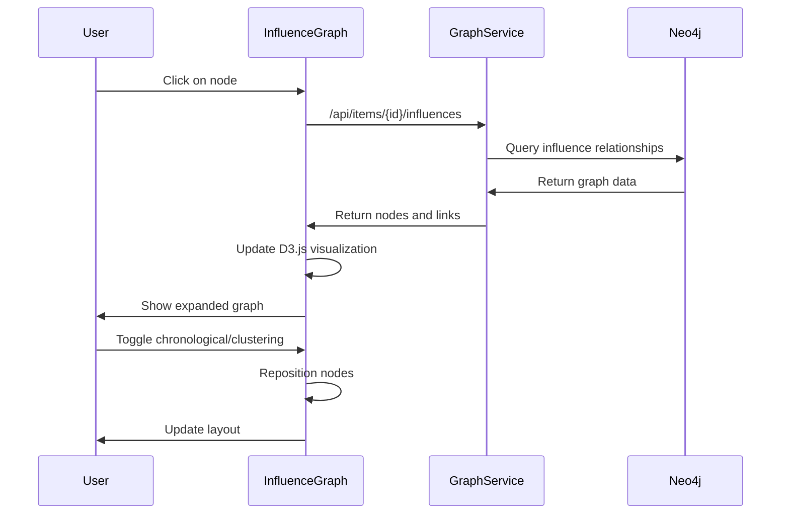
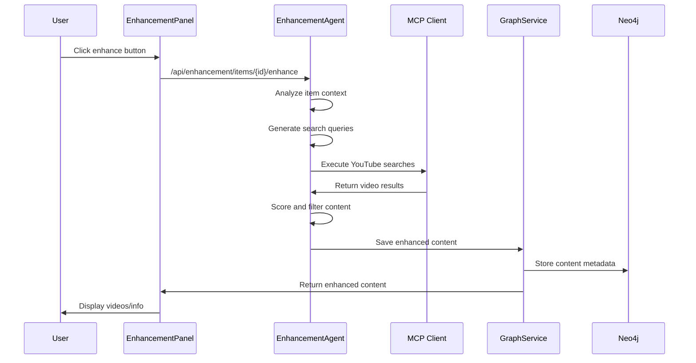
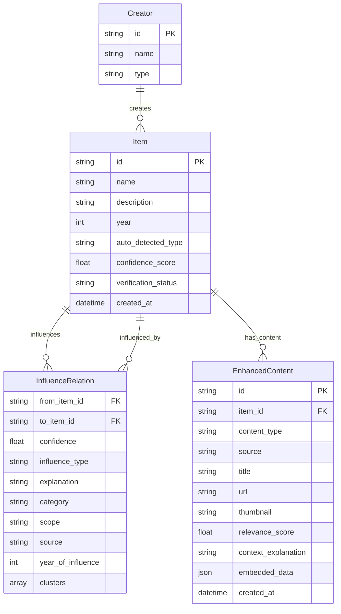
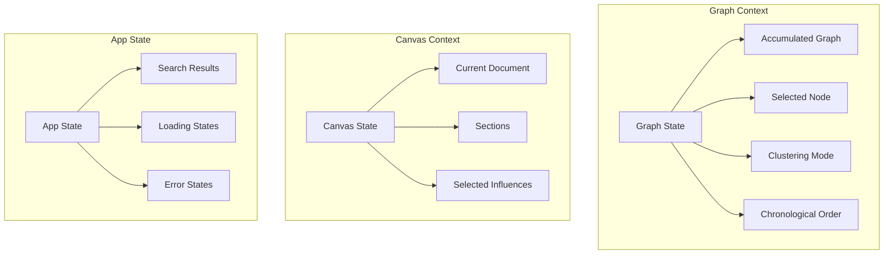
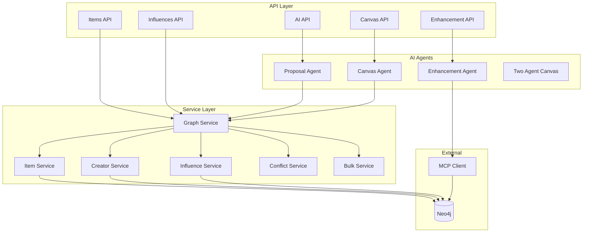
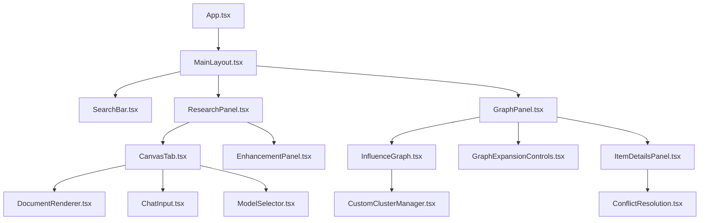

# 🕸️ Influence Graph - Current System Overview

*Last updated: January 2025*

This document describes how the Influence Graph system **actually works** in its current state, not how it's intended to work or planned features.

## 🏗️ System Architecture

### High-Level Architecture

### Component Architecture

## 🔄 Data Flow

### 1. Research & Influence Discovery Flow

### 2. Canvas Research Flow

### 3. Graph Visualization Flow

### 4. Content Enhancement Flow

## 📊 Data Model

### Core Database Schema

### Frontend State Management

## 🎯 Key Features & How They Work

### 1. AI-Powered Influence Discovery

**Current Implementation:**
- Uses LangChain-based `ProposalAgent` with temperature 0.4
- Generates exactly 6 proposals: 2 macro, 2 micro, 2 nano
- Each proposal includes confidence scores (0.6-0.9 range)
- Supports scope-based filtering (macro/micro/nano)
- Includes conflict detection before saving

**Scope Definitions:**
- **Macro**: Major foundational influences (genres, movements, major works)
- **Micro**: Specific techniques and elements (methods, regional scenes, specific works)
- **Nano**: Tiny details and specifics (sounds, tools, personal moments)

### 2. Canvas Research Mode

**Current Implementation:**
- Interactive document-based research interface
- Two-agent system available (single agent by default)
- Supports section-by-section refinement
- Users can edit content and select which influences to save
- Maintains document state between sessions

**Workflow:**
1. Generate initial research document with sections
2. Allow user editing and AI refinement
3. Select specific influences for graph integration
4. Save selected influences with conflict resolution

### 3. Graph Visualization

**Current Implementation:**
- D3.js-based interactive visualization
- Two layout modes: chronological and clustering
- Supports node expansion and edge highlighting
- Accumulative graph building (adds to existing graph)
- Custom cluster management available

**Layout Modes:**
- **Chronological**: Nodes positioned by year (x-axis)
- **Clustering**: Nodes grouped by influence categories
- **Custom**: User-defined cluster assignments

### 4. Content Enhancement

**Current Implementation:**
- YouTube MCP integration (Spotify/Wikipedia planned)
- AI-powered content analysis and scoring
- Relevance filtering (0-10 scale)
- Stores enhanced content in Neo4j database
- Supports up to 4 content pieces per item

**Enhancement Process:**
1. Analyze item context and type
2. Generate targeted search queries
3. Execute MCP tool searches
4. Score and filter results
5. Save relevant content with metadata

### 5. Conflict Resolution

**Current Implementation:**
- Comprehensive conflict detection for items and influences
- Preview system for merge decisions
- Supports item merging and relationship transfer
- Year validation (influences must predate influenced items)
- Confidence-based conflict resolution

## 🔧 Technical Implementation Details

### Backend Services Architecture

### Frontend Component Hierarchy

## 🚀 Current Capabilities

### ✅ What Works Now

1. **AI Influence Discovery**
   - Generates structured influence proposals
   - Scope-based categorization (macro/micro/nano)
   - Confidence scoring and validation
   - Conflict detection and resolution

2. **Interactive Graph Visualization**
   - D3.js-based interactive graph
   - Multiple layout modes
   - Node expansion and selection
   - Edge highlighting and filtering

3. **Canvas Research Mode**
   - Document-based research interface
   - Section editing and refinement
   - AI-powered content generation
   - Selective influence saving

4. **Content Enhancement**
   - YouTube MCP integration
   - AI-powered content analysis
   - Relevance scoring and filtering
   - Enhanced content storage

5. **Data Management**
   - Neo4j graph database
   - Comprehensive conflict resolution
   - Year validation
   - Confidence-based relationships

### 🔄 Current Data Flow Summary

1. **User Input** → Research Panel or Canvas Tab
2. **AI Processing** → Proposal Agent or Canvas Agent
3. **Conflict Detection** → Graph Service
4. **Data Storage** → Neo4j Database
5. **Graph Update** → D3.js Visualization
6. **Content Enhancement** → MCP Client → Enhanced Content Storage

### 📈 System Performance

- **Response Time**: AI proposals typically 5-15 seconds
- **Graph Rendering**: Handles up to 100+ nodes smoothly
- **Database**: Neo4j handles complex graph queries efficiently
- **MCP Integration**: YouTube searches complete in 2-5 seconds
- **Conflict Resolution**: Comprehensive detection in 1-3 seconds

## 🔮 Current Limitations

1. **MCP Integration**: Only YouTube currently implemented
2. **Graph Size**: Performance degrades with 200+ nodes
3. **AI Model**: Single model per agent (no model switching)
4. **Offline Support**: No offline functionality
5. **Collaboration**: No multi-user support
6. **Export**: Limited export capabilities
7. **Mobile**: No mobile-optimized interface

This overview represents the current state of the Influence Graph system as it actually exists and functions today. 